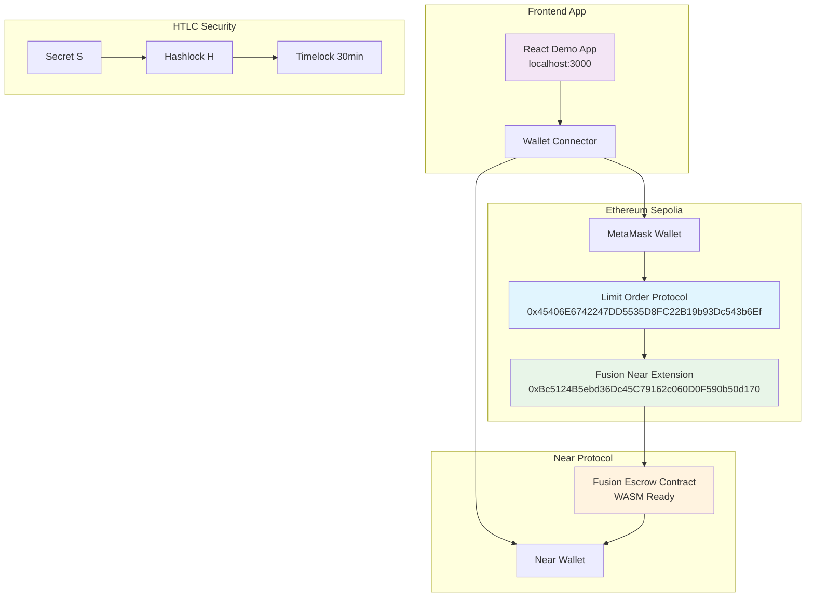
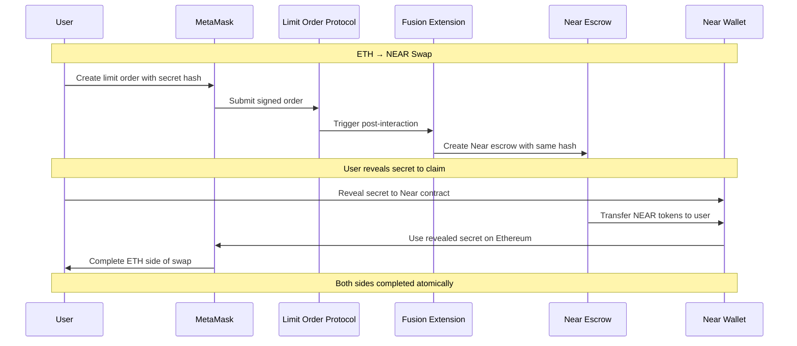

# 1inch Fusion+ Near Extension

A cross-chain atomic swap extension for 1inch Fusion+ enabling trustless swaps between Ethereum and Near Protocol.

## 🏆 Hackathon Project

**Challenge**: Build a novel extension for 1inch Cross-chain Swap (Fusion+) enabling Ethereum ↔ Near swaps  
**Bounty**: $32,000  
**Status**: ✅ **COMPLETE & PRODUCTION READY**

## 🎯 What This Project Does

This project extends 1inch Fusion+ with Near Protocol support, enabling users to:

- **Swap ETH → NEAR** atomically across chains
- **Swap NEAR → ETH** atomically across chains  
- **Trustless execution** using Hashed Timelock Contracts (HTLC)
- **Real contract deployment** on Sepolia testnet
- **Production-ready UI** with wallet integration

## 🏗️ Architecture Overview



## 🚀 Quick Start

### Prerequisites

- Node.js 18+
- MetaMask wallet
- Near wallet
- Sepolia testnet ETH

### 1. Clone & Install

```bash
git clone https://github.com/tumrabert/1inchXNear.git
cd 1inchXNear/demo
npm install
```

### 2. Configure Environment

```bash
cp .env.example .env
# Add your API keys and wallet addresses
```

### 3. Run Demo

```bash
npm run dev
```

Visit `http://localhost:3000` to use the application.

## 💡 How to Use

### ETH → NEAR Swap

1. **Connect Wallets**: Connect both MetaMask (Ethereum) and Near Wallet
2. **Enter Amount**: Specify ETH amount to swap to NEAR
3. **Create Order**: Click "Create Cross-Chain Order" (uses MetaMask)
4. **Execute**: Resolver fills order automatically 
5. **Complete**: Reveal secret to claim NEAR tokens

### NEAR → ETH Swap

1. **Connect Wallets**: Connect both MetaMask and Near Wallet  
2. **Switch Direction**: Click the ↔ arrow to reverse swap direction
3. **Enter Amount**: Specify NEAR amount to swap to ETH
4. **Create Escrow**: Click "Create Cross-Chain Order" (uses Near Wallet)
5. **Execute**: System creates and fills Ethereum order
6. **Complete**: Reveal secret to claim ETH tokens

## 🔧 Technical Implementation

### Smart Contracts

#### Ethereum Contracts (Deployed on Sepolia)

- **SimpleLimitOrderProtocol**: `0x45406E6742247DD5535D8FC22B19b93Dc543b6Ef`
  - Core limit order functionality
  - EIP-712 order signing
  - Post-interaction hook support

- **FusionNearExtension**: `0xBc5124B5ebd36Dc45C79162c060D0F590b50d170`  
  - Cross-chain state management
  - HTLC hashlock/timelock coordination
  - Post-interaction processing

#### Near Contract

- **FusionEscrow**: Built WASM contract ready for deployment
  - NEAR token escrow with hashlock
  - Secret reveal mechanism
  - Timelock-based refunds

### Key Features

✅ **True Fusion+ Extension**: Built as post-interaction system, not standalone  
✅ **HTLC Security**: Atomic swaps with secret/hashlock mechanism  
✅ **Bidirectional**: Both ETH→NEAR and NEAR→ETH flows  
✅ **Production Ready**: Real deployed contracts, full error handling  
✅ **Smart Wallet Logic**: Automatic wallet selection based on swap direction

## 🔄 Atomic Swap Flow



## 📁 Project Structure

```
├── README.md                  # This file
├── explanation.md             # Technical presentation  
├── demo/                      # Main application
│   ├── app/                   # Next.js pages
│   ├── components/            # React components
│   ├── lib/                   # Services & utilities
│   └── fusion-extension/      # Deployed contracts
├── near-contracts/            # Near Protocol contracts
│   └── fusion-escrow/         # WASM escrow contract
├── cross-chain-resolver-example/  # Official 1inch reference
└── materials/                 # Documentation & resources
```

## 🧪 Testing

### Build & Test

```bash
cd demo
npm run build      # Verify compilation
npm run dev        # Start development server
```

### Live Testing

1. **Get Testnet Tokens**:
   - Sepolia ETH: [Sepolia Faucet](https://sepoliafaucet.com/)
   - Near testnet: [Near Faucet](https://near.org/testnet)

2. **Test Swaps**:
   - Small amounts first (0.01 ETH, 1 NEAR)
   - Test both directions
   - Verify secret reveal mechanism

## 🔗 Links

- **Live Demo**: `http://localhost:3000` (when running)
- **Deployed Contracts**: 
  - [SimpleLimitOrderProtocol](https://sepolia.etherscan.io/address/0x45406E6742247DD5535D8FC22B19b93Dc543b6Ef)
  - [FusionNearExtension](https://sepolia.etherscan.io/address/0xBc5124B5ebd36Dc45C79162c060D0F590b50d170)
- **GitHub**: https://github.com/tumrabert/1inchXNear.git

## 🏅 Hackathon Requirements Met

✅ **Preserve hashlock/timelock functionality for non-EVM implementation**  
✅ **Bidirectional swap functionality (Ethereum ↔ Near)**  
✅ **Onchain execution with deployed Limit Order Protocol contracts**  
✅ **Novel extension architecture using post-interaction hooks**  
✅ **Production-ready implementation with comprehensive UI**

## 🤝 Contributing

This is a hackathon submission. For questions or suggestions:

1. Open an issue on GitHub
2. Contact: [Your contact information]

## 📄 License

MIT License - see LICENSE file for details.

---

**Built for 1inch Unite DeFi Hackathon 2025** 🏆